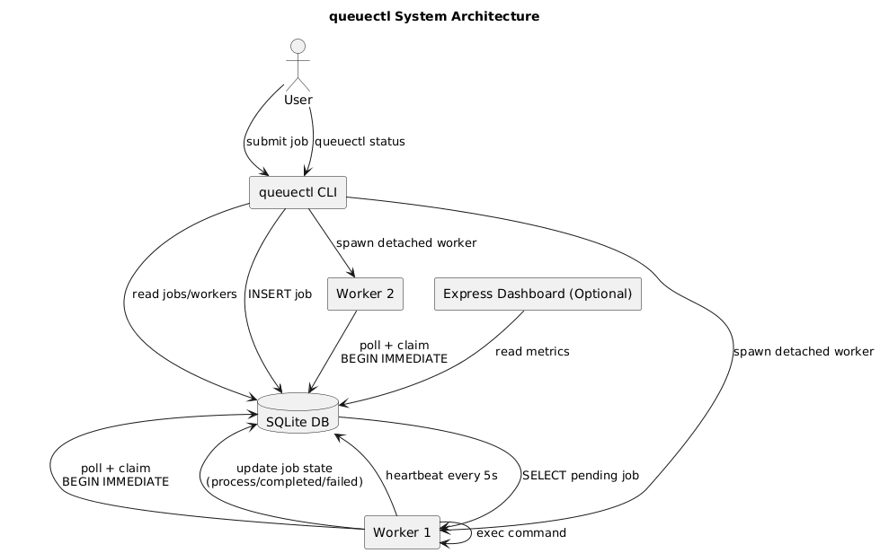
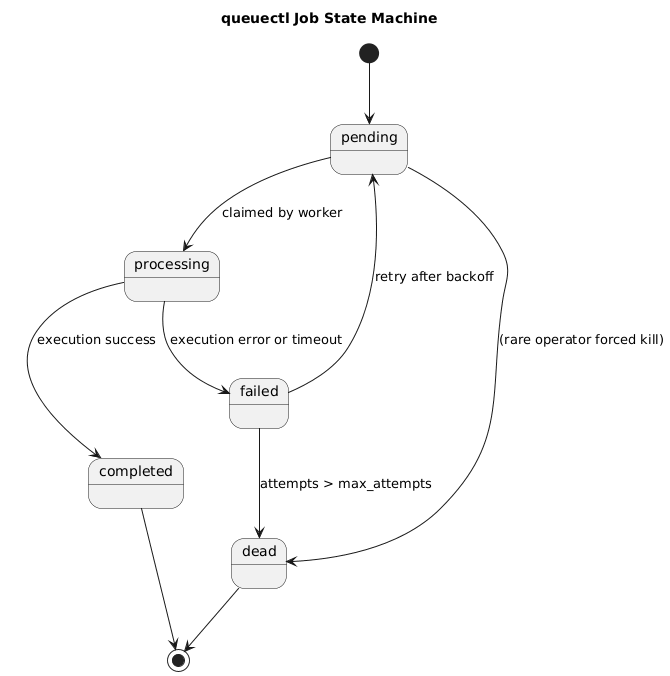

# System Design of QueueCTL  
> *A Production-Grade Local Job Queue with SQLite Coordination*

---

## 1. Overview

queuectl is a single-binary CLI for scheduling and executing background jobs on a single machine. It uses SQLite not only for durable storage but also as a coordination and locking engine, borrowing correctness ideas from distributed systems while keeping the architecture simple, predictable, and robust.

This document explains the system architecture, locking semantics, worker lifecycle, resilience guarantees, and scaling limitations.

### Tech Stack

- Node.js (v14+)
- sqlite3 (native SQLite driver)
- sqlite (Promise wrapper)
- commander.js — CLI framework
- Express.js — optional dashboard server

---

## 2. Architecture & Rationale

### 2.1 Why Polling Over Event-Driven Designs?

For a local, file-backed database like SQLite, polling is the most predictable and correct mechanism:

- Simplicity: Workers just wake up, attempt to claim a job, and sleep again.
- No cross-process event bus: WebSockets or file watchers add complexity without improving correctness.
- Composes with SQLite locking: Poll → transactional claim → execute → commit.
- Backpressure built-in: Fewer jobs → less DB pressure → reduced CPU usage.

### 2.2 SQLite as the Coordinator

SQLite is not used merely as a table store. It acts as:

- A serialization point for job claiming.
- A concurrency lock manager using `BEGIN IMMEDIATE`.
- A durable log of job lifecycle transitions.

SQLite guarantees that only one writer can modify pending jobs at a time, giving us safe mutual exclusion across many workers.

---

## 3. System Architecture


---

## 4. The Secret Sauce — Concurrency & Locking

### 4.1 Preventing Race Conditions

Two or more workers might see the same eligible pending job. queuectl prevents duplicate execution using a single SQLite transaction:

- `BEGIN IMMEDIATE` acquires a write-intent lock.
- Only one worker can read-and-claim at a time.
- The transition `pending → processing` occurs atomically.

### 4.2 Locking Algorithm (Pseudocode)

```pseudo
function claim_next_job(now):
  BEGIN IMMEDIATE;

  job = SELECT id
        FROM jobs
        WHERE state = 'pending'
          AND next_run_at <= :now
        ORDER BY created_at ASC
        LIMIT 1;

  if job exists:
    UPDATE jobs
      SET state='processing',
          attempts = attempts + 1,
          locked_at = :now
      WHERE id = job.id;

    COMMIT;
    return job.id;

  else:
    COMMIT;
    return null;
```

Properties:

- Atomic claim  
- Single-writer semantics  
- No two workers can grab the same job  
- Backoff handled via next_run_at gating  

---

## 5. Worker Internals

### 5.1 Detached Operation

Workers are spawned using:

```js
spawn(process.execPath, [binaryPath, 'worker'], {
  detached: true,
  stdio: 'ignore'
}).unref();
```

This ensures workers continue running even after the terminal session ends.

### 5.2 Heartbeats

Workers write into a `workers` table:

- On startup: insert a row
- Every 5 seconds: update `last_heartbeat`

Used by `queuectl status` to show active workers.

### 5.3 Graceful Shutdown

Workers:

- Listen for `SIGINT` and `SIGTERM`
- Set a shutdown flag
- Finish the current job
- Exit gracefully  
- Also monitor for a `.stop_workers` “poison pill” file for coordinated shutdowns

### 5.4 Job Execution

Jobs are executed using:

```js
child_process.exec(cmd, { timeout: job_timeout })
```

Captures stdout, stderr, exit code, timeout, etc.

---

## 6. Resilience Mechanisms

### 6.1 At-Least-Once Delivery

queuectl prefers re-executing a job twice over losing it.

If a worker hard-crashes:

- job remains in `processing`
- operator can requeue  
- nothing is silently dropped

### 6.2 Exponential Backoff

Retry delay:

```
delay_seconds = base ^ attempts
next_run_at = now + delay_seconds
```

### 6.3 Dead Letter Queue

When `max_attempts` is exceeded:

- job enters `dead`
- no further retries
- manual intervention required

---

## 7. Data Model

### 7.1 Job States (FSM)



### 7.2 Tables

`jobs TABLE`

| Column        | Type      | Notes |
|---------------|-----------|-------|
| id            | integer PK | |
| state         | text | pending, processing, completed, failed, dead |
| command       | text | command to execute |
| attempts      | integer | incremented on claim |
| max_attempts  | integer | DLQ threshold |
| created_at    | datetime | |
| locked_at     | datetime | |
| last_error    | text | |
| exit_code     | int | |
| next_run_at   | datetime | retry scheduling |
| timeout_ms    | integer | per-job override |

`workers TABLE`

| Column          | Type | Notes |
|------------------|------|-------|
| id | text | worker UUID |
| pid | integer | OS PID |
| hostname | text | |
| started_at | datetime | |
| last_heartbeat | datetime | |

`config TABLE`

Runtime-adjustable settings:
- max_concurrent_jobs
- job_retry_delay
- worker_heartbeat_interval
- job_timeout
- backoff_strategy
- backoff_base
- default_max_tries

---

## 8. Worker Loop (Detailed)

1. Check `.stop_workers` flag  
2. Heartbeat if needed  
3. Attempt claim (using `BEGIN IMMEDIATE`)  
4. If no job, sleep  
5. If job claimed:
   - run command
   - on success → mark `completed`
   - on failure → set backoff and retry
   - on max attempts → move to `dead`

---

## 9. SQLite Locking Deep Dive

- `BEGIN IMMEDIATE` takes a reserved lock
- Ensures mutual exclusion
- Prevents other writers from entering a claim cycle
- Readers (status commands/dashboard) can still read safely

> No `BEGIN EXCLUSIVE` needed — too heavy and blocks readers.

---

## 10. Correctness Considerations

- Jobs should be idempotent due to at-least-once execution  
- System clock accuracy affects scheduling (NTP recommended)  
- Retry backoff prevents starvation  
- Long logs should be external files, not stored inline  
- Commands run via shell; sandboxing recommended for untrusted code  

---

## 11. Performance Notes

- Short transactions minimize DB lock time  
- Index on `(state, next_run_at, created_at)` is critical  
- WAL mode improves dashboard-read concurrency  
- One-job-per-transaction preserves fairness  

---

## 12. Limitations & Future Work

### 12.1 Fundamental Limitations

- SQLite file locking limits queuectl to **one machine only**
- Cannot scale horizontally
- High write contention limits maximum worker count
- No full sandboxing/isolation for executed commands

### 12.2 Future Enhancements

- Stuck-job automatic reaper
- Prometheus/OpenTelemetry metrics
- Pluggable storage engines (Postgres, MySQL)
- Worker resource limits (ulimits, cgroups)

---

## 13. Appendix — SQL Snippets

### Claim Transaction

```sql
BEGIN IMMEDIATE;

WITH next_job AS (
  SELECT id
  FROM jobs
  WHERE state='pending'
    AND next_run_at <= :now
  ORDER BY created_at ASC
  LIMIT 1
)
UPDATE jobs
SET state='processing',
    attempts = attempts + 1,
    locked_at = :now
WHERE id = (SELECT id FROM next_job);

COMMIT;
```

### Mark Success

```sql
UPDATE jobs
SET state='completed',
    exit_code=0,
    last_error=NULL,
    locked_at=NULL
WHERE id=:id;
```

### Mark Failure / Backoff

```sql
UPDATE jobs
SET state = CASE WHEN attempts >= max_attempts THEN 'dead' ELSE 'pending' END,
    last_error = :error,
    exit_code = :code,
    next_run_at = :next_run_at,
    locked_at=NULL
WHERE id=:id;
```

### Heartbeat

```sql
UPDATE workers SET last_heartbeat=:now WHERE id=:worker_id;
```

---