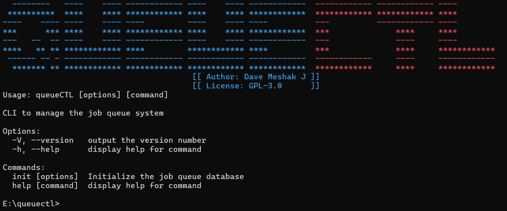

# QueueCTL - CLI-based background job queue system



>A small, self-hosted job queue and worker system with a CLI and a lightweight web dashboard.

[](./.github/workflows/ci.yml)


## Table of Contents
- [Setup — Run locally (shim-only)](#setup--run-locally-shim-only)
- [Quick demo (end-to-end)](#quick-demo-end-to-end)
- [Usage examples (CLI)](#usage-examples-cli)
- [Architecture overview](#architecture-overview)
- [Assumptions & trade-offs](#assumptions--trade-offs)
- [Testing instructions](#testing-instructions)

## Setup instructions — Run locally

Prerequisites

- Node.js v18 / v20 / v22 (LTS recommended)
- npm

Quick install

```bash
# from the repository root
npm install
```

Run the CLI without installing globally

```bash
# run any command via node
node ./bin/queuectl.js --help
```

Optional: make `queuectl` available system-wide (developer convenience)

```bash
npm link    # creates a global shim that points to this repo
# or to install globally (not required for development):
npm install -g .
```

Notes for Windows

- Global shims on Windows may appear as `queuectl.cmd`. If you use `npm link`, re-run it after editing the CLI so the shim points to the current code.

---

## Quick demo (end-to-end)
Copy/paste these commands from the project root to see a minimal end-to-end run (DB init → start worker → enqueue job → check status):

```bash
# 1) initialize DB
queuectl init

# 2) start 1 worker in background
queuectl worker start --count 1

# 3) enqueue a tiny job
queuectl enqueue '{"id":"demo-1","command":"node -e \"console.log(\\'hello demo\\')\""}'

# 4) check status
queuectl status

# 5) optional: open dashboard (foreground)
node ./web/server
#or via CLI: 
queuectl web start
```

Expected results
- `init` prints success
- `worker start` prints the background PID message
- `enqueue` confirms job insertion
- `status` reports active workers and job counts (pending/completed)

---

## Usage examples (CLI)

Cheat sheet

| Task | Command |
|------|---------|
| Initialize DB | `queuectl init` |
| Start workers | `queuectl worker start --count 2` |
| Stop workers  | `queuectl worker stop` |
| Enqueue job   | `queuectl enqueue '{"id":"job-1","command":"node -e \"console.log(\\'work\\')\""}'` |
| List DLQ      | `queuectl dlq list` |
| Retry DLQ     | `queuectl dlq retry <id>` |
| Set config    | `queuectl config set default_max_tries 5` |
| Dashboard     | `queuectl web start` or `queuectl web start --daemon` |

Examples

```bash
queuectl init
# => [+] Database initialization complete.

queuectl enqueue '{"id":"job-1","command":"node -e \"console.log(\\'work\\')\""}'
# => [+] Successfully enqueued job 'job-1'.

queuectl worker start --count 2
queuectl status
```

---

## Architecture overview

High level components
- CLI (`bin/queuectl.js`) — single entrypoint built with `commander` that performs DB initialization and exposes management commands (init, enqueue, worker start/stop, web start/stop, dlq, config, status).
- Worker (`worker.js`) — simple Node process that registers a heartbeat in `workers` table and polls the `jobs` table for ready work.
- Persistence (`job-queue.db`) — SQLite database (managed through `dbHandler.js`) that stores `jobs`, `workers`, and `config` tables.
- Dashboard (`web/server.js`) — Express app that serves a static `dashboard.html` and exposes `/api/summary` for the UI.

### Job lifecycle (simplified)
1. Enqueue: job inserted with state `pending`, `next_run_at` defaults to now and `max_attempts` configured.
2. Worker picks job: worker atomically marks a job `processing` (poll/update), increments `attempts`.
3. Execution: worker spawns the job command; on success job -> `completed` and `updated_at` changed.
4. Failure & retry: on failure worker schedules the next attempt (backoff), job remains `pending`/`failed` until attempts exceed `max_attempts`.
5. Dead-letter (DLQ): when attempts >= max, job is moved to `dead` for inspection/retry via `dlq retry`.

### Concurrency & resilience
- Workers are independent Node processes; concurrency is achieved by running multiple workers. DB state transitions avoid double-processing.
- SQLite keeps deployment simple; great for single-node/dev use, not intended for large multi-node clustered throughput.

### Data model (high level)

| Table   | Key columns                                                                                  |
|---------|-----------------------------------------------------------------------------------------------|
| jobs    | id, command, state, attempts, max_attempts, next_run_at, created_at, updated_at, last_error |
| workers | pid, hostname, last_heartbeat, registered_at                                                 |
| config  | key, value (defaults include `default_max_tries`, `backoff_base`, etc.)                      |

---

## Assumptions & trade-offs
- Simplicity over distributed scale: SQLite is intentionally chosen for ease-of-use.
- Polling workers: easy to reason about, but adds periodic DB load vs. push-based consumers.
- No auth on dashboard/api by default: intended for localhost-only usage. Add a proxy or auth in front for production.
- Retry/backoff: configurable base; extend for exponential with jitter if needed.
- Tests are integration-style (spawn real processes) for higher confidence.

---

## Testing instructions

Short checklist

```bash
npm install
npm test
```

If you see "Cannot find module" errors in spawned child processes, tests assume `node_modules` are at the repo root. On some shells you may need to set `NODE_PATH` before running tests:

```bash
# Bash (Linux/macOS/WSL/git-bash):
export NODE_PATH=$(pwd)/node_modules
npm test

# PowerShell (Windows):
$env:NODE_PATH = (Resolve-Path .\node_modules).Path
npm test
```

Smoke test

```bash
queuectl init
queuectl worker start --count 1
queuectl enqueue '{"id":"smoke-1","command":"node -e \"console.log(\\'smoke\\')\""}'
queuectl status
```

More docs
- Full testing instructions and troubleshooting are in `TESTING.md` 
---

## Author
Made by Dave for FLAM | [Portfolio](https://iamdave.vercel.app)

## License
This project is licensed under GPL-3.0. For more details check the [License](./LICENSE) file.
